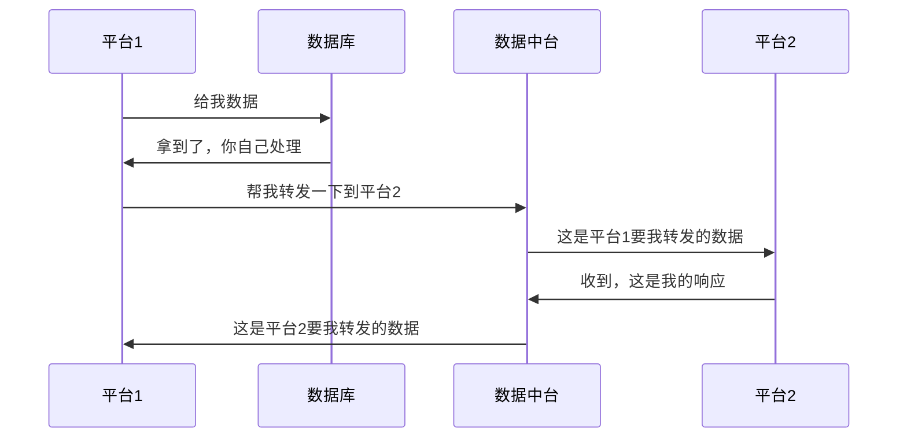

# 技术笔记

## 1.JQUERY实现onchange select选项卡动态改变选项

```html
<div class="ba_cell">
     <div class="ba_flex">
         <span>XX类型：</span>
         <select class="form-control" id="XX_TYPE" name="XX_TYPE" onchange="changeBusinessType()" >
         <option value="">-请选择-</option>
         <option value="1" <c:if test="${'1'==pd.XX_TYPE}">selected</c:if>>XX产品</option>
         <option value="2" <c:if test="${'2'==pd.XX_TYPE}">selected</c:if>>XX产品</option>
         </select>
     </div>
</div>
```

```javascript
function changeBusinessType(){
	    if( $('select[name="XX_TYPE"]').val() == '1'){
            $('select[name="XX"]').empty();
            $('select[name="XX"]').html('<option value="">-请选择-</option>'+
                '<c:forEach items="${currencyArray}" var="item">'+
                 '<option value="${item}" <c:if test="${item == pd.XX}">selected</c:if>>${item}</option>'+
                '</c:forEach>');
            $('#XX_TYPE_DIV').show();
            $('select[name="XX_TYPE"]').attr("disabled", false);
	    }else if( $('select[name="XX_TYPE"]').val() == '2'){
	        $('select[name="XX"]').empty();
            $('select[name="XX"]').html('<option value="">-请选择-</option>'+
                '<option value="?" <c:if test="${'?' == pd.XX}">selected</c:if>>?</option>'
             );
            $('select[name="XX"]').find('option[value="?"]').attr("selected","selected");
            $('#XX_TYPE_DIV').hide();
            $('select[name="XX_TYPE"]').attr("disabled", true);
	    }
	}
```

还需要在$(function () {})里初始化好选项少的那一种情况

如果使用chzn-select插件:
```javascript
$('#IS_NEW_QUERY_DATA option[value="0"]').prop('selected', true);
//修改完DOM节点对于chzn-select插件一定要手动触发更新事件
$("#IS_NEW_QUERY_DATA").trigger("liszt:updated");
```
## 2.使用AJAX踩过的坑
AJAX 传 MutipartFile(文件)
使用FormData对象，是可以使用一系列的键值对来模拟一个完整的表单，然后使用XMLHttpRequest发送这个"表单"。
```html
<form id="upladForm" enctype="multipart/form-data">
    <input id="file" type="file" name="file"/>
    <button id="upload" type="button">upload</button>
</form>
```

```javascript
$.ajax({
    url: "/upload",
    type: 'POST',
    cache: false,
    data: new FormData($("#uploadForm")[0]),
    processData: false,
    contentType: false,
    success: function (result) {
    },
    error: function (err) {
    }
});
```

```js
var file = $("#ueUploadImg")[0].files[0];
var data = new FormData();
data.append('upFile',file);
//上传图片
$.ajax({
type:'POST',
url:'<%=basePath%>policyIntroduction/uploadUeImage.do',
contentType:false,
processData:false,
data:data,
dataType:"json",
mimeType:"multipart/form-data",
success:function(res){
    if(res.status == "success"){
    //图片上传成功，生成 标签插入内容区
    ue.execCommand('inserthtml', '');
    }
},
})
```
这里要注意几点：<br>
:::warning
1.processData设置为false。因为data值是FormData对象，不需要对数据做处理。

2.form标签添加enctype="multipart/form-data"属性。

3.cache设置为false，上传文件不需要缓存。

4.contentType设置为false。因为是由表单构造的FormData对象，且已经声明了属性enctype="multipart/form-data"，所以这里设置为false。

5.不用AJAX的话直接用input type="submit"上传即可
:::
依赖包：

```xml
<dependency>
            <groupId>commons-io</groupId>
            <artifactId>commons-io</artifactId>
            <version>2.6</version>
</dependency>

<!-- https://mvnrepository.com/artifact/commons-fileupload/commons-fileupload -->
<dependency>
            <groupId>commons-fileupload</groupId>
            <artifactId>commons-fileupload</artifactId>
            <version>1.3.3</version>
</dependency>
```

步骤：

formData包装键值对 后，再用request.open("post","url")   request.send(formData)发送ajax请求（也可以像上面一样用$.ajax()），注意request是一个XMLHTMLrequest对象

```javascript
var formData = new FormData();

formData.append("username", "Groucho");
formData.append("accountnum", 123456); //数字 123456 会被立即转换成字符串 "123456"

// HTML 文件类型 input，由用户选择
formData.append("userfile", fileInputElement.files[0]);

// JavaScript file-like 对象
var content = '<a id="a"><b id="b">hey!</b></a>'; // 新文件的正文
var blob = new Blob([content], { type: "text/xml"});

formData.append("webmasterfile", blob);

var request = new XMLHttpRequest();
request.open("POST", "http://foo.com/submitform.php");
request.send(formData);
```

更加具体查看：

[FormData 对象的使用 - Web API 接口参考 | MDN](https://developer.mozilla.org/zh-CN/docs/Web/API/FormData/Using_FormData_Objects#%E4%B8%8D%E4%BD%BF%E7%94%A8formdata%E5%AF%B9%E8%B1%A1%E9%80%9A%E8%BF%87ajax%E6%8F%90%E4%BA%A4%E8%A1%A8%E5%8D%95%E5%92%8C%E4%B8%8A%E4%BC%A0%E6%96%87%E4%BB%B6)


2022.12.27新增：

如果用jquery的$.ajaxFileUpload函数:

```html
<td><input type="file" id="WJ" name="WJ" onchange="fileType(this)"/></td>
```

```javascript
$.ajaxFileUpload({
		url:'<%=basePath%>xx/xx.do',
		type:'post',
		data: {"BUSINESS_TYPE":$("#BUSINESS_TYPE").val()},
	    dataType : 'json', 
		secureuri : false,
	    fileElementId : 'WJ',
	    success : function(data) {
	    },
	    error : function(data) {
	    	location.reload();
	    }
	});
```

可以在上传文件的同时使用data这一个选项，顺便把数据也传到后台，当然也可以像上面一样用$.ajax然后把所有数据使用Formdata()对象包装传到后台

## 3.MySQL联合索引在特殊情况下不匹配最左匹配原则
第一种情况是Mysql8.0以上,MySql支持了索引跳跃扫描(index skip scan)：

[我说MySQL联合索引遵循最左前缀匹配原则，面试官让我回去等通知 - 掘金](https://juejin.cn/post/7127656601044910094)

特殊情况是这样的:

一般情况下：

我们建立一个联合索引

INDEX `idx_key_part`(`key_part1`, `key_part2`, `key_part3`) USING BTREE

也就是三列联合索引

理论上

select  *  from  表 where key_part1=?

select * from 表 where key_part1=? and key_part2=?

select * from 表 where key_part1=? and key_part2=? and key_part3=?

遵循最左匹配原则，都走这个索引

select * from 表 where key_part2=? 是不会走索引的

但是！

<mark>select key_part1,key_part2,key_part3 from 表 where key_part2=?</mark>

这个语句却是会走联合索引的

innodb引擎默认主键列是聚簇索引

其他索引其实是在它的基础上建立的辅助索引，也就是说他们的数据结构叶子节点储存的其实是主键的值，要真正拿到所有数据还得根据主键回聚簇索引树上去拿

当你要查找的列只是在联合索引列的范围内时，MySql不需要去扫描聚簇索引的树，只需要在这颗联合索引的树上就能查找到，也就是说不需要去回表了,这就是覆盖索引

## 4.自定义注解
注解的两个主要使用方式：<br>
1.拦截器拦截-遍历方法注解-处理逻辑
定义注解：
```java
@Target(ElementType.METHOD)
@Retention(RetentionPolicy.RUNTIME)
public @interface LoginRequired {

}
```
spring的写法 定义Interceptor 然后写一个WebMvcConfigurer把Interceptor加进去

```java
public class SourceAccessInterceptor implements HandlerInterceptor {
 @Override
 public boolean preHandle(HttpServletRequest request, HttpServletResponse response, Object handler) throws Exception {
 System.out.println("进入拦截器了");
 return true;
 }
@Override
public void postHandle(HttpServletRequest request, HttpServletResponse response, Object handler, ModelAndView modelAndView) throws Exception {

}

@Override
public void afterCompletion(HttpServletRequest request, HttpServletResponse response, Object handler, Exception ex) throws Exception {

}
```

```java
@Configuration
public class InterceptorTrainConfigurer implements WebMvcConfigurer {
 @Override
 public void addInterceptors(InterceptorRegistry registry) {
 registry.addInterceptor(new SourceAccessInterceptor()).addPathPatterns("/**");
 }
}
```

拦截器里写注解逻辑：

```java
@Override
 public boolean preHandle(HttpServletRequest request, HttpServletResponse response, Object handler) throws Exception {
 System.out.println("进入拦截器了");
 // 反射获取方法上的LoginRequred注解
    HandlerMethod handlerMethod = (HandlerMethod)handler;
    LoginRequired loginRequired = handlerMethod.getMethod().getAnnotation(LoginRequired.class);
    if(loginRequired == null){
        return true;
    }

    // 有LoginRequired注解说明需要登录，提示用户登录
    response.setContentType("application/json; charset=utf-8");
    response.getWriter().print("你访问的资源需要登录");
    return false;
}
```

2.自定义注解+AOP 实现日志打印写切面类：
   使用依赖:
   >aspectjweaver-1.9.6.jar
```java
//写一个注解类:
import java.lang.annotation.ElementType;
import java.lang.annotation.Retention;
import java.lang.annotation.RetentionPolicy;
import java.lang.annotation.Target;

@Target({ElementType.METHOD})
@Retention(RetentionPolicy.RUNTIME)
public @interface LogExecTime {
    String value() default ""; // 方法描述参数，默认为空
}

```
```java
//写一个切面类:
import com.data.annotation.LogExecTime;
import org.apache.commons.lang.StringUtils;
import org.aspectj.lang.ProceedingJoinPoint;
import org.aspectj.lang.annotation.Around;
import org.aspectj.lang.annotation.Aspect;
import org.slf4j.Logger;
import org.slf4j.LoggerFactory;
import org.springframework.stereotype.Component;

@Aspect
@Component
public class MethodExecutionTimeAspect {

    private static final Logger logger = LoggerFactory.getLogger(MethodExecutionTimeAspect.class);

    @Around("@annotation(logExecTime)") // 使用@Around注解
    public Object logMethodExecTime(ProceedingJoinPoint joinPoint,LogExecTime logExecTime) throws Throwable {
        String methodName = joinPoint.getSignature().getName();
        long startTime = System.currentTimeMillis();
        Object result = joinPoint.proceed(); // 执行目标方法
        long endTime = System.currentTimeMillis();
        long executionTime = endTime - startTime;
        String value = logExecTime.value();
        if (StringUtils.isNotBlank(value)) {
            methodName = value;
        }
        logger.info("================【{}】执行时间：【{}】ms=================", methodName, executionTime);
        return result; // 返回目标方法的执行结果
    }

}
```

```java
//需要增强的方法上加上注解：
 import com.data.annotation.LogExecTime;
import com.data.service.TestService;
import org.springframework.beans.BeansException;
import org.springframework.beans.factory.annotation.Autowired;
import org.springframework.context.ApplicationContext;
import org.springframework.context.ApplicationContextAware;
import org.springframework.stereotype.Controller;
import org.springframework.web.bind.annotation.RequestMapping;
import org.springframework.web.bind.annotation.ResponseBody;

/**
 * @author linxh
 * @date 2023-09-08 10:50
 */
@RequestMapping("/myTest")
@Controller
public class TestController implements ApplicationContextAware {

    private ApplicationContext applicationContext;
    @Autowired
    private TestService testService;

    @RequestMapping("/test")
    @ResponseBody
    @LogExecTime("good1")
    public void test(){
        TestController controller = (TestController) applicationContext.getBean("testController");
        controller.test2();
        testService.test3();
    }

    @LogExecTime("good2")
    public void test2(){
        for (int i = 0; i < 10000; i++) {
            System.out.println("test2");
        }
    }


    @Override
    public void setApplicationContext(ApplicationContext applicationContext) throws BeansException {
        this.applicationContext = applicationContext;
    }
}
```

```java
//service
package com.data.service;

import com.data.annotation.LogExecTime;
import org.springframework.stereotype.Service;

/**
 * @author linxh
 * @date 2023-09-08 11:40
 */
@Service
public class TestService  {
    @LogExecTime("good3")
    public void test3(){
        for (int i = 0; i < 10000; i++) {
            System.out.println("test3");
        }
    }

}
```

:::warning
1.调用自定义注解方法所在的类必须被spring所接管，也就是注册成为一个bean,否则spring代理就会失效，也就不能实现注解效果了（一般使用test方法做测试时）<br>
2.同时spring或者springvc的配置文件中需要引入这些语句：
:::
```xml
<!-- (1)启用注解 -->
<context:annotation-config />
<!-- (2)扫描指定包下的注解 -->
<context:component-scan base-package="com.fh" />
<!-- (3)通知spring使用cglib而不是jdk的来生成代理方法 -->
<aop:aspectj-autoproxy proxy-target-class="true" />
```
:::info
如果已经引入了第二句，第一句可以不引入，因为第二句其实就包含了第一句,<br>同时使用时第一句会被忽略
:::
一般来说,spring的配置文件配置除了Controller注解外的其他注解，springMVC的配置文件只配置Controller注解:
>spring配置文件:
```xml
<context:component-scan base-package="com.data">
    <context:exclude-filter type="annotation" expression="org.springframework.stereotype.Controller" />
</context:component-scan>
```
>springMVC配置文件:
```xml
<!-- 只扫描@Controller，必须将use-default-filters设置为false才能确保只扫描Controller注解 -->
<context:component-scan base-package="com.data" use-default-filters="false">
    <context:include-filter type="annotation" expression="org.springframework.stereotype.Controller" />
</context:component-scan>
```
## 5.fisco上链开发

1 用WEBASE写合约 ：[WeBASE](http://200.200.100.181:5000/#/login)

asset.sol/XXXContract.sol （一般用这种命名）如果是很多版本记得在后面加上__Vxx（数字）来表示第几版

2 生成JAVA类放进项目里(com/data/contract)

3 配置好环境 (fisco sdk,Spring（节点IP:监听端口）, client)（这一步一般项目都配好了不用做）

4.

XXXClient中：

初始化代码片段：

```java
/**
     * 初始化，得到bcosSDK、client、cryptoKeyPair对象
     * @throws Exception
     */
    public void initialize() throws Exception {
        // 函数initialize中进行初始化
        // 初始化BcosSDK
        @SuppressWarnings("resource")
        ApplicationContext context =
                new ClassPathXmlApplicationContext("classpath:ApplicationContext.xml");
        bcosSDK = context.getBean(BcosSDK.class);
        // 初始化可向群组1发交易的Client
        client = bcosSDK.getClient(1);
        // 随机生成发送交易的公私钥对
        cryptoKeyPair = client.getCryptoSuite().createKeyPair();
        client.getCryptoSuite().setCryptoKeyPair(cryptoKeyPair);
        logger.debug("create client for group1, account address is " + cryptoKeyPair.getAddress());
    }
```

初始化代码的主要功能为构造Client与CryptoKeyPair对象，这两个对象在创建对应的合约类对象(调用合约类的deploy或者load函数)时需要使用,

在XXXClient里写包装过的方法来调用合约类的原生方法：

XXXClient:

```java
 /**
     * 合约部署
     */
    public void deployAssetAndRecordAddr() {
        try {
            // 部署合约，Asset4就是一个合约类
            Asset4 asset = Asset4.deploy(client, cryptoKeyPair);
            System.out.println(
                    " deploy Asset4 success, contract address is " + asset.getContractAddress());
            recordAssetAddr(asset.getContractAddress());
        } catch (Exception e) {
            // TODO Auto-generated catch block
            e.printStackTrace();
            System.out.println(" deploy Asset4 contract failed, error message is  " + e.getMessage());
        }
    }
```

5 如果xxxService里不希望通过注入一个xxxClient来进行deploy和load，也可以通过

@PostConstruct注解

在 bean都注入之后通过

```java
client = bankBcosSDK.getClient(1);

cryptoKeyPair = client.getCryptoSuite().createKeyPair();

client.getCryptoSuite().setCryptoKeyPair(cryptoKeyPair);
```

拿到client与CryptoKeyPair对象(本质上就是把xxxService当做一个XXXClient)

完整代码：

XXXService:

```java
    @PostConstruct
    public void initialize() throws Exception {
        // 初始化可向群组1发交易的client
        client = bankBcosSDK.getClient(1);
        // 随机生成发送交易的公私钥对
        cryptoKeyPair = client.getCryptoSuite().createKeyPair();
        client.getCryptoSuite().setCryptoKeyPair(cryptoKeyPair);
        logger.info("########创建群组1的客户端， account 地址 is " + cryptoKeyPair.getAddress());

        PageData contractInfo = contractLocalInfoService.getDeployContractInfo("ComCreditInfoQueryContract1");
        if (StringUtils.isNotBlank(contractInfo.getString("address"))) {
            contractAddress = contractInfo.getString("address");
            // 加载合约
            contract = ComCreditInfoQueryContract1.load(contractAddress, client, cryptoKeyPair);
            logger.info("########加载【企业信用信息查询合约】成功, 合约地址是：{}", contractAddress);
        } else { //如果为空，说明之前没有部署该合约，那就部署合约并将地址保存到本地数据库中
            contract = ComCreditInfoQueryContract1.deploy(client, cryptoKeyPair);
            contractAddress = contract.getContractAddress();
            contractLocalInfoService.recordContractAddr(contractAddress, contractInfo.getString("solContractName")); // 将合约地址保存本地数据库中
            logger.info("########部署【企业信用信息查询合约】成功, 合约地址是：{}", contractAddress);
        }
        logger.info("########【企业信用信息查询合约】service初始化完成！");
    }
```

调用自定义的方法来完成与区块链的增删改查：

```java
//registerData是我们要传上链的数据拼接成的字符串
TransactionReceipt transactionReceipt = 
contract.registerComCreditInfoQuery(registerData);`//这个方法是我们自己根据需求写的
```

合约.sol文件里定义的event对应的emit会把相应的参数传回来：

比如

xxxContract.sol:

```solidity
event TransferEvent(int256 ret, string from_account, string to_account, uint256 amount);

...
//省略其他代码
emit TransferEvent(ret_code, from_account, to_account, amount);//关注的是ret_code
```

通过传回来的参数码，就可以知道与区块链交互的情况：

```java
List<RegisterComCreditInfoQueryEventEventResponse> 
registerComCreditInfoQueryEventEvents 
= contract.getRegisterComCreditInfoQueryEventEvents(transactionReceipt);
```

```java
//注意ret这个参数，就是上面定义好的第一个参数
if (!registerComCreditInfoQueryEventEvents.isEmpty()) {
   if (registerComCreditInfoQueryEventEvents.get(0).ret.compareTo(new BigInteger("0")) == 0) {
                    logger.info("########【企业信用信息查询合约】数据注册成功，注册数据为：{}", data.toString());
                } else if (registerComCreditInfoQueryEventEvents.get(0).ret.compareTo(new BigInteger("-1")) == 0) {
                    logger.error("########【企业信用信息查询合约】数据注册失败：数据已存在！数据为：{}", data.toString());
                    throw new Exception("processNumber：" + data.getProcessNumber() 
                            + ",queryTime：" + data.getQueryTime() + "已存在！");
                } else {
                    logger.error("########无权限或者其他错误!");
                    throw new Exception("无权限或者其他错误!");
                }
            } else {
                logger.error("########没有找到事件日志，可能事务没有执行!");
                throw new Exception("没有找到事件日志，可能事务没有执行!");
            }
```

这里的0和-1分别代表什么 是开发人员自己定义的，比如这里0就是成功 -1就是失败

## 6.shiro认证

认证登录的流程：

1拿到Subject门面对象

2调用isAuthenticate()方法来判断用户是否登录

3登录了就进入应用

4未登录就将用户输入的用户名和密码封装成一个token

5Subject调用login(token)方法

6找到我们自定义的realm

7调用里面的getAuthenticationInfo()方法拿到一个AuthenticationInfo对象

8调用CredentialsMatcher中的doCredentialsMatch方法将info和token进行对比

9有多种对比模式 简单对比、加盐对比 。。

10对比通过了仍要判断多个realm通过的策略是什么，是只要有一个比对通过就登录，还是

全部比对通过就登录？还是。。。

11满足的这些策略后就放行登录成功


```java
//1、获取SecurityManager工厂，此处使用Ini配置文件初始化SecurityManager     
Factory<org.apache.shiro.mgt.SecurityManager> factory = new IniSecurityManagerFactory("classpath:shiro.ini");

//2、得到SecurityManager实例    
org.apache.shiro.mgt.SecurityManager securityManager = factory.getInstance();

//3、设定全局的securityManager
SecurityUtils.setSecurityManager(securityManager);
```

代码接上的：


自定义过滤器要注意：


shiroFilter(在进入servlet之前)->interceptor(在进入controller之前)

两边都要放行过去


```javascript
<!--引入弹窗组件start-->
<script type="text/javascript" src="plugins/attention/zDialog/zDrag.js"></script>
<script type="text/javascript" src="plugins/attention/zDialog/zDialog.js"></script>
<!--引入弹窗组件end-->
```

总结：subject.login（token）实际上调用了securityManager.login(subject,token)方法


single:


multi:


到AuthenticatingRealm里了：


（1）爷爷类 （2）父类 （3）子类

常用的AuthorizingRealm(2)继承了AuthenticatingRealm(1)，我们又继承了AuthorizingRealm(2)

，所以我们自定义的realm(3)里制定的credentialsMatcher就会一步步往上走

doGetAuthenticationInfo（）方法

声明在AuthenticatingRealm（1）里,

doGetAuthorizationInfo（）方法

声明在AuthorizingRealm（2）里

都是抽象方法

需要我们自己实现

通过验证的PRIN

我们在自定义Realm的doGetAuthorizationInfo（）方法里查询数据库拿到用户的角色和权限后给到

```java
simpleAuthorizationInfo
```

```java
 for (Role role : user.getRoles()) {
            //添加角色
            simpleAuthorizationInfo.addRole(role.getRoleName());
            //添加权限
            for (Permissions permissions : role.getPermissions()) {
                simpleAuthorizationInfo.addStringPermission(permissions.getPermissionsName());
            }
        }
        return simpleAuthorizationInfo;
```

完整代码：

```java
package com.wsl.shiro;

import com.wsl.bean.Permissions;
import com.wsl.bean.Role;
import com.wsl.bean.User;
import com.wsl.service.LoginService;
import org.apache.shiro.authc.AuthenticationException;
import org.apache.shiro.authc.AuthenticationInfo;
import org.apache.shiro.authc.AuthenticationToken;
import org.apache.shiro.authc.SimpleAuthenticationInfo;
import org.apache.shiro.authz.AuthorizationInfo;
import org.apache.shiro.authz.SimpleAuthorizationInfo;
import org.apache.shiro.realm.AuthorizingRealm;
import org.apache.shiro.subject.PrincipalCollection;
import org.springframework.beans.factory.annotation.Autowired;
import org.springframework.util.StringUtils;

public class CustomRealm extends AuthorizingRealm {

    @Autowired
    private LoginService loginService;

/**      
@MethodName doGetAuthorizationInfo     
@Description 权限配置类     
@Param [principalCollection]     
@Return AuthorizationInfo     
@Author WangShiLin     */
    @Override
    protected AuthorizationInfo doGetAuthorizationInfo(PrincipalCollection principalCollection) {
        //获取登录用户名
        String name = (String) principalCollection.getPrimaryPrincipal();
        //查询用户名称
        User user = loginService.getUserByName(name);
        //添加角色和权限
        SimpleAuthorizationInfo simpleAuthorizationInfo = new SimpleAuthorizationInfo();
        for (Role role : user.getRoles()) {
            //添加角色
            simpleAuthorizationInfo.addRole(role.getRoleName());
            //添加权限
            for (Permissions permissions : role.getPermissions()) {
                simpleAuthorizationInfo.addStringPermission(permissions.getPermissionsName());
            }
        }
        return simpleAuthorizationInfo;
    }

/**   
@MethodName doGetAuthenticationInfo    
@Description 认证配置类     
@Param [authenticationToken]     
@Return AuthenticationInfo     
@Author WangShiLin     */
    @Override
    protected AuthenticationInfo doGetAuthenticationInfo(AuthenticationToken authenticationToken) throws AuthenticationException {
        if (StringUtils.isEmpty(authenticationToken.getPrincipal())) {
            return null;
        }
        //获取用户信息
        String name = authenticationToken.getPrincipal().toString();
        User user = loginService.getUserByName(name);
        if (user == null) {
            //这里返回后会报出对应异常
            return null;
        } else {
            //这里验证authenticationToken和simpleAuthenticationInfo的信息
            SimpleAuthenticationInfo simpleAuthenticationInfo = new SimpleAuthenticationInfo(name, user.getPassword().toString(), getName());
            return simpleAuthenticationInfo;
        }
    }
}
```

## 7.定时任务
spring定时任务的几种实现方式

一．分类
从实现的技术上来分类，目前主要有三种技术（或者说有三种产品）：

1.Java自带的java.util.Timer类，这个类允许你调度一个java.util.TimerTask任务。使用这种方式可以让你的程序按照某一个频度执行，但不能在指定时间运行。一般用的较少，不做详细介绍。

2.使用Quartz，这是一个功能比较强大的的调度器，可以让你的程序在指定时间执行，也可以按照某一个频度执行，配置起来稍显复杂。

3.Spring3.0以后自带的task，可以将它看成一个轻量级的Quartz，而且使用起来比Quartz简单许多。
从作业类的继承方式来讲，可以分为两类：
作业类需要继承自特定的作业类基类，如Quartz中需要继承自org.springframework.scheduling.quartz.QuartzJobBean；
java.util.Timer中需要继承自java.util.TimerTask。
作业类即普通的java类，不需要继承自任何基类。

从任务调度的触发时机来分，这里主要是针对作业使用的触发器，主要有以下两种：

每隔指定时间则触发一次，在Quartz中对应的触发器为：org.springframework.scheduling.quartz.SimpleTriggerBean

每到指定时间则触发一次，在Quartz中对应的调度器为：org.springframework.scheduling.quartz.CronTriggerBean

注：并非每种任务都可以使用这两种触发器，如java.util.TimerTask任务就只能使用第一种。Quartz和spring task都可以支持这两种触发条件。

二．用法
1、Java自带的java.util.Timer类，自定义一个类继承TimerTask
例子：

```java
package com.timertest;

import java.util.Timer;
import java.util.TimerTask;

public class TestTimerTask {
Timer timer;

public TestTimerTask(int a) {
    timer = new Timer();
    timer.schedule(new GoodTimerTask(),0, 1000*a);
}

public static void main(String[] args) {
    System.out.println("About to schedule task.");
    new TestTimerTask(3);
}

class GoodTimerTask extends TimerTask{
    @Override
    public void run() {
        System.out.println("Timer running!");
    }

}
```

2、Spring3.0以后自带的task

(1)在applicationContext.xml配置的方式
准备jar包:spring核心jar包
在项目中写个类:

```java
@Service
public class BookScheduleTask {
@Resource
private BookService bookService;

public Page<Book> findAllBook(){ //不带参数
    System.out.println("BookScheduleTask.findAllBook()");
    return bookService.findBook(1);
 }
}
```


在ApplicationContext.xml配置文件中写如下配置：

```xml
<!-- 自动扫描 -->
 <context:component-scan base-package="com" />
<!-- spring框架的Scheduled定时器 -->
<task:scheduled-tasks>
    <task:scheduled ref="bookScheduleTask" method="findAllBook" cron="0 0 12 * * ?"/>
</task:scheduled-tasks>

说明：(1)<context:component-scan base-package="com" />该配置，相信大家用过spring的都知道是什么意思，
         是spring用于扫描注解的
      (2)<task:scheduled-tasks>,该配置的作用是定义一个时间计划任务，定义某个类下面某个方法在某个时间执行。
         <task:scheduled ref="bookScheduleTask" method="findAllBook" cron="0 0 12 * * ?"/>，ref表示的是
     某个要在规定时间执行的类，method表示要执行的类下的某个方法，cron表示时间表达式，具体详细的表达式
     可以百度查询。
```


(2)基于注解的spring定时器
同上，准备好spring的jar包
在项目中创建一个类，用于执行定时任务的类。如下：

```java
@Component("bookScheduleTask")
 public class BookScheduleTask {
@Resource
private BookService bookService;

// @Scheduled(cron="0 50 14 * * ?")表示：该注解下的方法是一个时间任务，满足表达式cron="0 50 14 * * ?
@Scheduled(cron="0 50 14 * * ?")
public void findAllBook(){
    System.out.println("BookScheduleTask.findAllBook()");
    bookService.findBook(1);
   }
}
```


3.quartz

详见官方文档 [Quartz官方文档_w3cschool](https://www.w3cschool.cn/quartz_doc/)

## 8.关于jsp

JSP的标签头要记得：

```html
<%@ page language="java" contentType="text/html; charset=UTF-8"
 pageEncoding="UTF-8"%>
<%@ taglib prefix="c" uri="http://java.sun.com/jsp/jstl/core"%>
<%@ taglib prefix="fmt" uri="http://java.sun.com/jsp/jstl/fmt"%>
```

JSP是先翻译成SERVLET然后再编译SERVLET的

<%! %>声明

<% %>JAVA语句

<%= %>取值

<%@ %>定义

常用声明:

```java
<%
 String path = request.getContextPath();
 String basePath = request.getScheme() + "://"
 + request.getServerName() + ":" + request.getServerPort()
 + path + "/";
%>
<base href="<%=basePath%>">//改变JSP的初始化路径
```

一个参考的JSP模板

```html
<%@ page language="java" contentType="text/html; charset=UTF-8"
	pageEncoding="UTF-8"%>
<%@ taglib prefix="c" uri="http://java.sun.com/jsp/jstl/core"%>
<%@ taglib prefix="fmt" uri="http://java.sun.com/jsp/jstl/fmt"%>
<%
String path = request.getContextPath();
String basePath = request.getScheme() + "://" + request.getServerName() + ":" + request.getServerPort() + path + "/";
%>
<!DOCTYPE html>
<html lang="zh-CN">
<head>
<base href="<%=basePath%>">
<!-- jsp文件头和头部 -->
<%@ include file="../system/admin/top.jsp"%>
<link rel="stylesheet" href="static/css/my.css" />
</head>
<body>
</body>
</html>
```

<fmt:formatNumber pattern="#.##" maxFractionDigits="2" value="${pd.ZCSXJE}"/>

表示把数值字符串格式化为小数点后保留两位的形式

<fmt:formatDate pattern="yyyy-MM-dd HH:mm:ss" value="${var.CRE_TIME}"/>

表示把Date类型的日期格式化为yyyy-MM-dd HH:mm:ss形式，注意是Date类型 不要使用其他函数把日期已经转为字符串类型了
## 9.SQL和正则的坑
SQL：容易出现}没有写全<br>
更新表的同时如果要进行子查询要把子查询的表命名为别的表<br>
正则: 像点.这种特殊符号要加\\\来反义，要不然出来结果<br>
MYSQL是没有全外连接的写法的，也不支持SQL92<br>
代替写法是用union all(不去重,代价小)/union(去重,代价大)把left join和right join给连接起来<br>
一种技巧是把union all或union 连接起来的两边分别用'X' AS TYPE ,'Y' AS TYPE来作区分
就能知道是从哪边哪张表拿出来的记录<br>
left join/right join一般情况下(没有加索引)要比inner join的代价大，因为要完全扫描左表/右表

## 10.Bootstrap实现标签卡高亮切换

```javascript
function goToPage(id){
 $("#" + id ).addClass("active").siblings().removeClass("active");
}
```

siblings()返回同级元素
这个方法来实现选项卡高亮的功能
每个选项卡后面都加了onclick="goToPage('divxx')"

```html
<ul class="nav nav-tabs flex-column">
  <li class="nav-item">
    <a id="div01" data-toggle="tab" class="nav-link active" href="#" onclick="goToPage('div01')">Active</a>
  </li>
  <li class="nav-item">
    <a id="div02" data-toggle="tab" class="nav-link" href="#" onclick="goToPage('div02')">Link</a>
  </li>
  <li class="nav-item">
    <a id="div03" data-toggle="tab" class="nav-link" href="#" onclick="goToPage('div03')">Link</a>
  </li>
  <li class="nav-item">
    <a id="div04" data-toggle="tab" class="nav-link" href="#" onclick="goToPage('div04')">Link</a>
  </li>
</ul>
```


## 11.springboot项目跑JSP

要在SPRINGBOOT项目里跑JSP：

1 新建一个WEBAPP

2 ECLIPSE里把它设为项目包/IDEA不需要

3 下面建JSP文件夹WEB-INF

4 下面建JSP文件

5 引入 tomcat-embed-jasper 和 jstl 的包

6 WEBAPP下可以放一个web.xml

7 配置文件里写视图解析器

spring:
 mvc:
  view:
   prefix: /WEB-INF/jsp
   suffix: .jsp

springmvc里的return注意：/寻找的是路径 不带/返回的是页面

两个div默认是各占一行的
同一行的话用bootstrap的row就可以 用col-sm-X来控制大小（加起来是12） 本质上是flex布局
如果不用就要设置为行内元素 inline 或者两者都用float

## 12.Mybatis-Plus和Bootstrap-table实现分页

```java
    @GetMapping("/fenye")
    @ResponseBody
    public void fenye() {
        //不用写SQL，第一个参数是分页条件page，第二个是查询条件包装类对象
        Page<User> userPage = userMapper.selectPage(new Page<User>(1,3),
                 new QueryWrapper<User>()
                    .between("age",18,50)
            );
        //自定义XML分页,自己写SQL
        IPage<User> myPage = userMapper.selectPageVo(new Page<User>(2,3));
        System.out.println("MP自带分页-------------"+userPage.getRecords());
        System.out.println("XML自定义分页-------------"+myPage.getRecords());
    }
```


```java
public interface UserMapper extends BaseMapper<User> {
    public User getOneById(int id);

    IPage<User> selectPageVo(Page<?> page);//XML自己写分页
}
```

```xml
<mapper namespace="com.example.demo.mapper.UserMapper">
    <select id="getOneById" parameterType="int" resultType="com.example.demo.pojo.User">
        SELECT * FROM user WHERE id=#{id}
    </select>

    <select id="selectPageVo" resultType="com.example.demo.pojo.User">
        SELECT * FROM user WHERE age between 18 and 50
    </select>
</mapper>
```

```yml
mybatis-plus:
  mapper-locations: classpath*:mapper/*.xml
```

```java
@SpringBootApplication
@MapperScan("com.example.demo.mapper")
public class DemoApplication {

    public static void main(String[] args) {
        SpringApplication.run(DemoApplication.class, args);
    }

}
```

MP实现的分页是物理分页 实际上还是用limit来查询

物理查询：根据limit条件查询多次，内存负担小，服务器负担大

逻辑查询（内存查询）：一次性把所有数据都放到内存里再做筛选，内存负担大，服务器负担小

物理查询的实时性强，数据量过大的时候的优解（MP和MH都是）

逻辑查询适用于数据量不大而且变化不大的情况

MP多表的时候各个表一定要用别名as 要重新引入新的MP依赖

用Bootstrap-table做前端页面 实现分页

```html
<!DOCTYPE html>
<html xmlns:th="http://www.thymeleaf.org" lang="zh-CN">

<head>
    <meta charset="UTF-8">
    <title>Title</title>
    <link rel="stylesheet" href="https://stackpath.bootstrapcdn.com/bootstrap/4.3.1/css/bootstrap.min.css"
        integrity="sha384-ggOyR0iXCbMQv3Xipma34MD+dH/1fQ784/j6cY/iJTQUOhcWr7x9JvoRxT2MZw1T" crossorigin="anonymous">
    <link rel="stylesheet" href="https://unpkg.com/bootstrap-table@1.20.2/dist/bootstrap-table.min.css">
</head>

<div class="container-fluid">
    <div class="panel panel-default">
        <div class="panel-heading">
            查询条件
        </div>
        <div class="panel-body form-group" style="margin-bottom:0px;">
            <label class="col-sm-1 control-label" style="text-align: right; margin-top:5px">姓名：</label>
            <div class="col-sm-2">
                <input type="text" class="form-control" name="userName" id="search_name" />
            </div>
            <label class="col-sm-1 control-label" style="text-align: right; margin-top:5px">年龄：</label>
            <div class="col-sm-2">
                <input type="text" class="form-control" name="age" id="search_age" />
            </div>
            <div class="col-sm-1 col-sm-offset-4">
                <button class="btn btn-primary" id="search_btn">查询</button>
            </div>

        </div>
        <table id="mytab" class="table table-hover "></table>
    </div>
    <script src="https://cdn.bootcdn.net/ajax/libs/jquery/3.5.1/jquery.js"></script>
    <script src="https://cdnjs.cloudflare.com/ajax/libs/popper.js/1.14.7/umd/popper.min.js"
        integrity="sha384-UO2eT0CpHqdSJQ6hJty5KVphtPhzWj9WO1clHTMGa3JDZwrnQq4sF86dIHNDz0W1"
        crossorigin="anonymous"></script>
    <script src="https://stackpath.bootstrapcdn.com/bootstrap/4.3.1/js/bootstrap.min.js"
        integrity="sha384-JjSmVgyd0p3pXB1rRibZUAYoIIy6OrQ6VrjIEaFf/nJGzIxFDsf4x0xIM+B07jRM"
        crossorigin="anonymous"></script>
    <script src="https://unpkg.com/bootstrap-table@1.20.2/dist/bootstrap-table.min.js"></script>
    <script>
        $('#mytab').bootstrapTable({
            method: 'get',
            url: "/fenye",//请求路径
            striped: true, //是否显示行间隔色
            pageNumber: 1, //初始化加载第一页
            pagination: true,//是否分页
            sidePagination: 'server',//server:服务器端分页|client：前端分页
            pageSize: 3,//单页记录数
            pageList: [5, 10, 20, 30],//可选择单页记录数
            showRefresh: true,//刷新按钮
            queryParams: function (params) {//上传服务器的参数
                var temp = {//如果是在服务器端实现分页，limit、offset这两个参数是必须的
                    limit: params.limit, // 每页显示数量
                    offset: params.offset, // SQL语句起始索引
                    page: (params.offset / params.limit) + 1, //当前页码 
                    userName: $('#search_name').val(),
                    age: $('#search_age').val()
                };
                return temp;
            },
            columns: [{
                field: 'checked',
                checkbox: true,
                align: 'center',
                valign: 'middle',
            }, {
                title: '用户名',
                field: 'userName',
            }, {
                title: '密码',
                field: 'password',
            },
            {
                title: '年龄',
                field: 'age',
                sortable: true
            }, {
                title: '角色',
                field: 'roleName',
            }, {
                title: '操作',
                field: 'id',
                formatter: operation,//对资源进行操作
            }]
        });
        //value代表该列的值，row代表当前对象
        //function formatSex(value, row, index) {
        //return value == 1 ? "男" : "女";
        //或者 return row.sex == 1 ? "男" : "女";
        //}
        //删除、编辑操作
        function operation(value, row, index) {
            var htm = "<button>删除</button><button>修改</button>"
            return htm;
        }
        //查询按钮事件
        $('#search_btn').click(function () {
            $('#mytab').bootstrapTable('refresh', {
                url: '/fenye'
            });
        })
    </script>
    </body>

</html>
```

```java
    @GetMapping("/fenye")
    @ResponseBody
    public MyPage<User> getUserListPage(User user) {
        if(user.getUserName().equals("")) {
            user.setUserName(null);
        }
        // 统计总记录数 page-current limit-size
        Map<String,Object> map = new HashMap<>();
        map.put("userName", user.getUserName());
        map.put("age",user.getAge());
        Page<User> userPage = userMapper.selectPage(new Page<User>(user.getPage(), user.getLimit()),
                new QueryWrapper<User>().allEq(map,false));
        MyPage<User> myPage = new MyPage<User>();
        myPage.setRows(userPage.getRecords());
        myPage.setTotal(userPage.getTotal());
        return myPage;
    }
```

```java
package com.example.demo.pojo;


import java.io.Serializable;
import com.baomidou.mybatisplus.annotation.TableField;
import com.example.demo.pojo.common.Page;

import lombok.AllArgsConstructor;


@AllArgsConstructor
public class User extends Page implements Serializable  {
    /**
     * 
     */
    private static final long serialVersionUID = 2809352790942997573L;

    private Long id;

    @TableField(value = "userName")
    private String userName;

    private String password;

    private Integer age;

    @TableField(value = "roleName")
    private String roleName;

    public Long getId() {
        return id;
    }

    public void setId(Long id) {
        this.id = id;
    }

    public String getUserName() {
        return userName;
    }

    public void setUserName(String userName) {
        this.userName = userName;
    }

    public String getPassword() {
        return password;
    }

    public void setPassword(String password) {
        this.password = password;
    }

    public Integer getAge() {
        return age;
    }

    public void setAge(Integer age) {
        this.age = age;
    }

    public String getRoleName() {
        return roleName;
    }

    public void setRoleName(String roleName) {
        this.roleName = roleName;
    }


}
```

```java
package com.example.demo.pojo.common;

import com.baomidou.mybatisplus.annotation.TableField;

/*
 * 这个类的主要作用是让User继承它 并且控制器一个变量就能接收完毕
 */
public class Page {

    //每页显示数量
    @TableField(exist=false)
    private int limit;

    //页码
    @TableField(exist=false)
    private int page;

    //sql语句起始索引
    @TableField(exist=false)
    private int offset;

    public int getLimit() {

        return limit;

    }

    public void setLimit(int limit) {

        this.limit = limit;

    }

    public int getPage() {

        return page;

    }

    public void setPage(int page) {

        this.page = page;

    }

    public int getOffset() {

        return offset;

    }

    public void setOffset(int offset) {

        this.offset = offset;

    }


}
```

返回前端的页面，要有total和rows两个属性

```java
package com.example.demo.pojo.common;

import java.util.ArrayList;

import java.util.List;

public class MyPage<T> {

    // 实体类集合

    private List<T> rows = new ArrayList<T>();

    // 数据总条数

    private long total;

    public MyPage() {

        super();

    }

    public List<T> getRows() {

        return rows;

    }

    public void setRows(List<T> rows) {

        this.rows = rows;

    }

    public long getTotal() {

        return total;

    }

    public void setTotal(long total) {

        this.total = total;

    }

}
```

## 13.JAVA里处理JSON时间格式的注解

@JsonFormat和@DateTimeFormat

1.前者处理后端传到前端

2.后者处理前端到后端（数据库）

@JsonFormat(pattern="yyyy-MM-dd",timezone = "GMT+8")

   pattern:是你需要转换的时间日期的格式

   timezone：是时间设置为东八区，避免时间在转换中有误差

依赖包是Jackson

@DateTimeFormat(pattern ="yyyy-MM-dd")

依赖包是jodatime

## 14.IDEA的一些实用插件(支持社区版)

### 1.codota/tabnine

代码智能提醒补全 

### 2.CodeGlance3/Pro

代码整体预览

### 3.Easy Javadoc

快速生成注释和JAVA文档

### 4.Maven Helper

给没有Maven功能的IDEA实现

### 5.MyBatisX

实现XML和JAVA代码相互跳转 代码自动生成

### 6.Smart Tomcat

给没有Tomcat功能的IDEA实现

### 7.Spring & Java Tools

### Spring Boot Assistant

### Spring Initalizr and Assistant

都是spring开发的插件，自带检查和提醒

### 8.Handy Export Jar

适合文件级别的打包

### 9.Translate

翻译神器

### 10.Grep Console

代码高亮 控制台高亮

### 11.Rainbow Brackets

彩虹括号 方便区分查看代码块

### 12.One Dark theme

经典主题配色

### 13.Atom Material Icons

经典图标主题

### 14.CodeTogether

远程合作开发利器

### 15.GsonFormat-Plus

Json转Java实体类 常用于文档转化代码

## 15.用工厂模式简化if-else分支

### 1.为什么不提倡这种写法？

你一定写过这样的代码：

```java
if{
    ......
}
else if{
    ......
}
else if{
    ......
}
else if{
    ......
}
else if{
    ......
}
else if{
     ......
}
else if{
    ......
}
else if{
    ......
}
else if{
    ......
}
else if{
    ......
}
else{
    ......
}
```

我们习惯在项目中同个业务对不同的角色类型、产品类型等进行判断来进行业务的分支处理，这样子免不了的就要写很多的if-elseif-else语句来做判断

如果类型数量不是特别多，并且处理的逻辑不是特别长的话没有什么问题，但是一旦数量非常多了或者处理逻辑非常长，那么整个代码块就会显得冗余繁杂，非常不利于后续维护代码，更麻烦的是如果处理逻辑内又继续嵌套了很多if-elseif-else语句，对于理解处理逻辑简直就是灾难，假如你需要对一个老旧的类型分支进行扩展或者修改，在无数个if-elseif-else语句块中定位到你要修改的地方是很难的，有人说不是可以用搜索来定位吗？可是一旦你拖动上下条去阅读其他的代码，要想再找到这部分代码就又要搜索一次，否则你只能保佑自己有火眼金睛一眼就能定位到你想找到的代码块。

### 2.怎么改进这种写法？

我们可以采用工厂模式来改进：

1、把类型分支抽象成一个公共接口或者抽象类：

```java
abstract class TypeItem{
    //每个类型都公有的属性
	protected String param1;
	protected Integer param2;
	protected String param3;
	protected PageData param4;
	
	public String getParam1() {
		return param1;
	}

	public void setParam1(String param1) {
		this.param1 = param1;
	}

	...//其他getter和setter

	public abstract PageData doSelf();//每个类型自己的实现逻辑
}
```

然后对每一个类型新建一个类来实现或者继承：

```java
class Type1 extends TypeItem{
	
	@Override
	public PageData doSelf() {
		xxx//这里可以用到公有的属性
	}
}
```

```java
class Type2 extends TypeItem{

    @Override
	public PageData doSelf() {
		xxx//这里可以用到公有的属性
	}
}
```

新建一个工厂类：

```java
public class TypeFactory {
    
   public TypeItem createTypeItem(String Type){
      if(Type == null){
         return null;
      }        
      if(Type.equalsIgnoreCase("Type1")){
         return new Type1();
      } else if(Type.equalsIgnoreCase("Type2")){
         return new Type2();
      } else if(Type.equalsIgnoreCase("...")){
         return new ....();
      }
      return null;
   }
}
```

然后我们new一个工厂对象，调用它的createTypeItem方法就可以得到我们需要的分支类型对象了:

```java
TypeFactory typeFactory = new TypeFactory();

TypeItem item1 = typeFactory.createTypeItem("Type1");
item1.doSelf();//类型分支1的实现方法

TypeItem item2 = typeFactory.getType("Type2");
item2.doSelf();//类型分支2的实现方法

...
```

这样，我们就实现了在真正的实现逻辑中去掉了反复书写if-elseif-else,其实本质上就是把这个分支判断转移到了工厂类里。

### 3.继续改进

上面虽然实现了实现逻辑与分支判断的解耦，但是现在的问题反而变成了在工厂类里有很多的if-elseif-else语句，能不能把这部分分支判断也给去掉呢？

我们可以用一个map来把所有的类型分支都给储存起来：

```java
Map<String, Class<? extends TypeItem>> typeMap = new HashMap<String, Class<? extends TypeItem>>();
typeMap.put("1", Type1.class);
typeMap.put("2", Type2.class);
typeMap.put("3", Type3.class);
typeMap.put("4", Type4.class);
typeMap.put("5", Type5.class);
typeMap.put("6", Type6.class);
typeMap.put("7", Type7.class);
//以后如果新增了分支就在这里添加就可以了
//typeMap.put("newType",newType.class);
```

改写一下工厂类里的方法：

```java
public TypeItem createTypeItem(String type,Map<String, Class<? extends TypeItem>> map) throws RuntimeException{
 try {
	   Class<? extends TypeItem> typeItemClass = map.get(type);
	   return typeItemClass.newInstance();
	 } catch (Exception e) {
	   logger.info("Unknown type Object!");
	   throw new NullPointerException();
	} 
}
```

现在，我们可以在真正的逻辑代码块里这样写：

```java
Map<String, Class<? extends TypeItem>> typeMap = new HashMap<String, Class<? extends TypeItem>>();
typeMap.put("1", Type1.class);
typeMap.put("2", Type2.class);
typeMap.put("3", Type3.class);
typeMap.put("4", Type4.class);
typeMap.put("5", Type5.class);
typeMap.put("6", Type6.class);
typeMap.put("7", Type7.class);
//以后如果新增了分支就在这里添加就可以了
//typeMap.put("newType",newType.class);
//这里是直接调用，当然也可以new一个工厂对象后再调用
TypeItem item = createTypeItem(type,typeMap);
item.setParam1(xx);
item.setParam2(xx);
item.setParam3(xx);
item.setParam4(xx);
pd = item.doSelf();
```

到此我们的改造就告一段落了，以后我们如果要新增一种分支类型，就新建一个类继承抽象类、重写自己的逻辑实现方法，并且在map后面新增一个put就可以了。如果要修改已有的分支类型的逻辑实现方法，就直接到自己的类文件里去修改自己的doSelf()方法就可以了，可读性和扩展性大大增强了。需要注意的是这种方法比较适合分支类型判断没有参数传入的情况，如果有参数的话就像上面一样用setter方法存进对象里。

## 16. Mermaid
Mermaid 是一个用于画流程图、状态图、时序图、甘特图的库，使用 JS 进行本地渲染，广泛集成于许多 Markdown 编辑器中,通过写文字和符号的形式就能自动画图，省去不少时间

[Mermaid在线编辑](https://mermaid.live/)

[Mermaid官方文档](https://mermaid.js.org/syntax/flowchart.html)

一个例子:



## 17. 全局异常处理
一个请求进入Controller 要针对很多种情况做try..catch，代码非常冗杂

1.可以用@ExceptionHandler标记的方法来做全局异常处理 该Controller里的方法抛出的异常都会被它捕获且走这个方法(针对Controller里所有的方法)

2.可以把流程都写好之后-service做处理-异常全部向外抛直到Controller，然后用一个大的try...catch包起来
用 e instanceof 特定异常的判断来做特殊处理(针对Controller里的一个方法)(常用)

```java
try{
    ...
}catch (Exception e) {
    // TODO: handle exception
    logger.error("=======XXX接口异常:", e);
    String errcode="";
    String errMsg="";
    //异常处理
    logger.info("++++",e.getCause());
    if( e instanceof TalentBizException ){
        //TalentBizException 业务异常
        TalentBizException t = (TalentBizException)e;
        errcode=t.getErrCode().getStatcode();
        errMsg=t.getErrInfo();
    }else if( e instanceof SQLException){
        //数据库操作异常
        errcode=ErrorCode.S00998.getStatcode();
        errMsg=ErrorCode.S00998.getStatinfo();
    } else{
        // 其他情况作为系统异常
        errcode=ErrorCode.S00999.getStatcode();
        errMsg=ErrorCode.S00999.getStatinfo();
    }
...
}
```
3.@ExceptionHandler搭配@ControllerAdvice(针对所有Controller的所有异常分别处理)

```java
import com.pjb.pms.entity.DBEntity.StaffInfo;
import org.apache.logging.log4j.LogManager;
import org.apache.logging.log4j.Logger;
import org.apache.shiro.SecurityUtils;
import org.apache.shiro.authz.UnauthorizedException;
import org.springframework.web.bind.annotation.ControllerAdvice;
import org.springframework.web.bind.annotation.ExceptionHandler;
import org.springframework.web.servlet.ModelAndView;
 
/**
 * 全局异常处理器
 * @author pan_junbiao
 **/
@ControllerAdvice
public class BusinessExceptionHandler
{
    //日志对象
    private Logger logger = LogManager.getLogger(BusinessExceptionHandler.class);
 
    /**
     * 自定义业务异常处理
     */
    @ExceptionHandler(BusinessException.class)
    public ModelAndView businessExceptionHandler(BusinessException ex)
    {
        //错误信息
        String errorMessage = ex.getErrorMessage();
 
        //记录异常日志
        logger.error("[业务异常]" + errorMessage);
 
        //返回错误页面
        ModelAndView modelAndView = new ModelAndView();
        modelAndView.addObject("errorMessage",errorMessage);
        modelAndView.setViewName("error.html");
        return modelAndView;
    }
 
    /**
     * Shiro无权限异常
     */
    @ExceptionHandler(UnauthorizedException.class)
    public ModelAndView unauthorizedExceptionHandler(UnauthorizedException ex)
    {
        //获取当前登录人
        StaffInfo currentSaff = (StaffInfo) SecurityUtils.getSubject().getPrincipal();
 
        //记录异常日志
        String logMeg = String.format("[403无权限] 操作人：%s；异常信息：%s；",currentSaff.getStaffName(),ex.toString());
        logger.error(logMeg);
 
        //返回403无权限页面
        ModelAndView modelAndView = new ModelAndView();
        modelAndView.setViewName("403.html");
        return modelAndView;
    }
 
    /**
     * 系统异常
     */
    @ExceptionHandler(Exception.class)
    public ModelAndView exceptionHandler(Exception ex)
    {
        //记录异常日志
        logger.error("[系统异常]" + ex.toString());
 
        //返回错误页面
        ModelAndView modelAndView = new ModelAndView();
        modelAndView.addObject("errorMessage","系统错误，请联系管理员");
        modelAndView.setViewName("error.html");
        return modelAndView;
    }
}
```

另外,@ControllerAdvice本质上也是一个Component,还可以搭配@ModelAttribute和@InitBinder使用
搭配@ModelAttribute：所有的Controller注入相同的属性:

```java
@ControllerAdvice
public class MyGlobalHandler {
    @ModelAttribute
    public void presetParam(Model model){
        model.addAttribute("globalAttr","this is a global attribute");
    }
}
```

搭配@InitBinder: 所有Controller请求参数预处理：

```java
@ControllerAdvice
public class MyGlobalHandler {

    @InitBinder
    public void processParam(WebDataBinder dataBinder){

        /*
         * 创建一个字符串微调编辑器
         * 参数{boolean emptyAsNull}: 是否把空字符串("")视为 null
         */
        StringTrimmerEditor trimmerEditor = new StringTrimmerEditor(true);

        /*
         * 注册自定义编辑器
         * 接受两个参数{Class<?> requiredType, PropertyEditor propertyEditor}
         * requiredType：所需处理的类型
         * propertyEditor：属性编辑器，StringTrimmerEditor就是 propertyEditor的一个子类
         */
        dataBinder.registerCustomEditor(String.class, trimmerEditor);
        
        //同上，这里就不再一步一步讲解了
        binder.registerCustomEditor(Date.class,
                new CustomDateEditor(new SimpleDateFormat("yyyy-MM-dd"), false));
    }
}

```

这三个注解都可以在Controller内单独使用，只不过使用范围只有它自己
搭配上@ControllerAdvice，使用范围就变成了所有Controller
 
4、还可以通过继承HandlerExceptionResolver来实现全局异常处理
```java
public class MyExceptionResolver implements HandlerExceptionResolver{
	private static Logger log = LoggerFactory.getLogger(MyExceptionResolver.class);

    @Override
	public ModelAndView resolveException(HttpServletRequest request,
			HttpServletResponse response, Object handler, Exception ex) {
		System.out.println("==============异常开始=============");
	    final Writer exMessage = new StringWriter();
	    final PrintWriter printWriter = new PrintWriter(exMessage);
	    ex.printStackTrace(printWriter);
	    ex.printStackTrace();
		log.error("=======系统异常:"+exMessage.toString());
		System.out.println("==============异常结束=============");
		ModelAndView mv = new ModelAndView("error");
		mv.addObject("exception", ex.toString().replaceAll("\n", "<br/>"));
		return mv;
	}

}
```

如果是springboot,直接在类上加@Configuration即可，如果是springmvc,在配置文件里加上:
```xml
<bean id="exceptionResolver" class="com.fh.resolver.MyExceptionResolver">
</bean>
```
## 18. MySQL的GROUP CONCAT函数
在我们平常的工作中，使用group by进行分组的场景，是非常多的。

比如想统计出用户表中，名称不同的用户的具体名称有哪些？

具体sql如下：

```sql
select name from `user` group by name;
```

如果想知道每个相同的name(也就是每个人)拥有的code都有哪一些，传统的做法是拿到name后
再去做一次查询

```sql
select code from `user` where name = xxx;
```

这只是一个人而已，对于所有人的数据，还得在程序里写要么用数组的方式迭代或者干脆用for循环一个一个拿，效率非常低，多了很多代码

我们可以用MYSQL自带的GROUP_CONCAT函数:

```sql
select name,group_concat(code) from `user` group by name;
```

一句SQL就解决了上述问题，现在同一个名字下拥有的所有code都会被展示出来，通过逗号分隔

## 19. Springboot里的@ServerEndpoint注解

@ServerEndpoint注解用在一个类上 代表把这个类注册为websocket的服务端，一旦使用这个注解，Spring就不会把这个类加入管理范围，在这个类上的@Component、@Controller等注解会无效，也不能通过注入的方式注入其他bean，只能手动注入：

使用一个工具类SpringUtils:
```java
import org.springframework.aop.framework.AopContext;
import org.springframework.beans.BeansException;
import org.springframework.beans.factory.NoSuchBeanDefinitionException;
import org.springframework.beans.factory.config.BeanFactoryPostProcessor;
import org.springframework.beans.factory.config.ConfigurableListableBeanFactory;
import org.springframework.stereotype.Component;

/**
 * spring工具类 方便在非spring管理环境中获取bean
 * 
 * @author haiyi
 */
@Component
public final class SpringUtils implements BeanFactoryPostProcessor
{
    /** Spring应用上下文环境 */
    private static ConfigurableListableBeanFactory beanFactory;

    @Override
    public void postProcessBeanFactory(ConfigurableListableBeanFactory beanFactory) throws BeansException
    {
        SpringUtils.beanFactory = beanFactory;
    }

    /**
     * 获取对象
     *
     * @param name
     * @return Object 一个以所给名字注册的bean的实例
     * @throws BeansException
     *
     */
    @SuppressWarnings("unchecked")
    public static <T> T getBean(String name) throws BeansException
    {
        return (T) beanFactory.getBean(name);
    }

    /**
     * 获取类型为requiredType的对象
     *
     * @param clz
     * @return
     * @throws BeansException
     *
     */
    public static <T> T getBean(Class<T> clz) throws BeansException
    {
        T result = (T) beanFactory.getBean(clz);
        return result;
    }

    public static <T> T getBean(String name, Class<T> clz) throws BeansException{
        T result = (T) beanFactory.getBean(name, clz);
        return result;
    }

    /**
     * 如果BeanFactory包含一个与所给名称匹配的bean定义，则返回true
     *
     * @param name
     * @return boolean
     */
    public static boolean containsBean(String name)
    {
        return beanFactory.containsBean(name);
    }

    /**
     * 判断以给定名字注册的bean定义是一个singleton还是一个prototype。 如果与给定名字相应的bean定义没有被找到，将会抛出一个异常（NoSuchBeanDefinitionException）
     *
     * @param name
     * @return boolean
     * @throws NoSuchBeanDefinitionException
     *
     */
    public static boolean isSingleton(String name) throws NoSuchBeanDefinitionException
    {
        return beanFactory.isSingleton(name);
    }

    /**
     * @param name
     * @return Class 注册对象的类型
     * @throws NoSuchBeanDefinitionException
     *
     */
    public static Class<?> getType(String name) throws NoSuchBeanDefinitionException
    {
        return beanFactory.getType(name);
    }

    /**
     * 如果给定的bean名字在bean定义中有别名，则返回这些别名
     *
     * @param name
     * @return
     * @throws NoSuchBeanDefinitionException
     *
     */
    public static String[] getAliases(String name) throws NoSuchBeanDefinitionException
    {
        return beanFactory.getAliases(name);
    }

    /**
     * 获取aop代理对象
     * 
     * @param invoker
     * @return
     */
    @SuppressWarnings("unchecked")
    public static <T> T getAopProxy(T invoker)
    {
        return (T) AopContext.currentProxy();
    }

    public static void registerSingleton(String beanName, Object singletonObject){
        beanFactory.registerSingleton(beanName,singletonObject);
    }
}

```

## 20. 百度Ueditor富文本上传图片不适用flash插件

:::tip
flash已经停止维护了
:::

### 在要上传图片的页面修改如下代码：

不修改源代码的情况下：
```html
<script id="editor" type="text/plain" style="width:80%;height:259px;">
${pd.NEWSCONTENT}
</script>
<input id="ueUploadImg" onchange="changeImg()" type="file" style="display:none;" accept="image/*" />
```

```js
var ue = UE.getEditor('editor');
UE.commands['uploadimg'] = {
    execCommand:function(){
        // 触发 文件选择
        $("#ueUploadImg").click();
    }
}
function changeImg(){
    var file = $("#ueUploadImg")[0].files[0];
    $("#ueUploadImg").val('');
    if(file){
        // 防止有人手输文件名
        if(!file.type.startsWith("image/")){
        $.messager.alert('提示',"请选择图片文件",'question');
        return;
        }
        var data = new FormData();
        data.append('upFile',file);
        //上传图片
        $.ajax({
        type:'POST',
        url:'<%=basePath%>policyIntroduction/uploadUeImage.do',
        contentType:false,
        processData:false,
        data:data,
        dataType:"json",
        mimeType:"multipart/form-data",
        success:function(res){
            if(res.status == "success"){
            //图片上传成功，生成 标签插入内容区
            ue.execCommand('inserthtml', '');
            }
        },
        })
    }
}
```

后台:

```java
@ResponseBody
@RequestMapping(value = "/uploadUeImage")
public String uploadUeImage(@RequestParam(value = "upFile", required = false) MultipartFile file) {
    Map<String, String> dataMap = new HashMap<>();
    try {
        String imagePath = PathUtil.getClasspath() + "uploadFiles/ueditor/jsp/upload1/" + DateUtil.getDays();
        if (file != null && !file.isEmpty()) {
            String fileName = file.getOriginalFilename().substring(0, file.getOriginalFilename().lastIndexOf("."));
            FileUpload.fileUp(file, imagePath, fileName);
            String wholeImagePath = "uploadFiles/ueditor/jsp/upload1/" + DateUtil.getDays() + "/" + file.getOriginalFilename();
            dataMap.put("url", wholeImagePath);
            dataMap.put("status", "success");
        }
    } catch (Exception e) {
        logger.error("##UEDITOR上传图片失败###", e);
        dataMap.put("status", "fail");
        return JSON.toString(dataMap);
    }
    return JSON.toString(dataMap);
}
```
### 要修改源码的配置文件：

ueditor.all.js:

```js
var btnCmds = ['undo', 'redo', 'formatmatch',
        'bold', 'italic', 'underline', 'fontborder', 'touppercase', 'tolowercase',
        'strikethrough', 'subscript', 'superscript', 'source', 'indent', 'outdent',
        'blockquote', 'pasteplain', 'pagebreak',
        'selectall', 'print','horizontal', 'removeformat', 'time', 'date', 'unlink',
        'insertparagraphbeforetable', 'insertrow', 'insertcol', 'mergeright', 'mergedown', 'deleterow',
        'deletecol', 'splittorows', 'splittocols', 'splittocells', 'mergecells', 'deletetable', 'drafts','uploadimg'];//最后的uploadimg
```

修改源码的情况下:
```js
/**
 * added by linxh 2024-11-08
 * 新增了一个通过input元素直接上传图片的插件
 * 本质是在页面里新增了一个id为ueUploadImg+随机值(防止重复)的file类型的input,上传完成后会销毁这个input
 * @type {{execCommand: UE.commands.uploadimg.execCommand}}
 */
UE.commands['uploadimg'] = {
    execCommand:function() {
        var me = this;
        var uniqueId = 'ueUploadImg'+ '_' + Math.random().toString(36).substr(2, 9);
        // 创建一个新的 <input> 元素
        var fileInput = document.createElement('input');
        fileInput.id = uniqueId;
        fileInput.type = 'file';
        fileInput.style.display = 'none';  // 设置为不可见
        fileInput.accept = 'image/*';      // 仅接受图片文件
        this.document.body.appendChild(fileInput);
        //给ueUploadImg元素绑定事件
        fileInput.addEventListener('change', function (event) {
            // 获取第一个文件
            var file = event.target.files[0];
            // 清空文件输入元素的值
            fileInput.value = '';
            if (file) {
                // 检查文件类型
                if (!file.type.startsWith('image/')) {
                    alert('请选择图片文件');
                    return;
                }

                var data = new FormData();
                data.append('upFile', file);

                // 上传图片
                var xhr = new XMLHttpRequest();
                xhr.open('POST', 'policyIntroduction/uploadUeImage.do', true);
                xhr.onload = function () {
                    if (xhr.status === 200) {
                        var res = JSON.parse(xhr.responseText);
                        if (res.status === 'success') {
                            // 图片上传成功，生成  标签插入内容区
                            me.execCommand('inserthtml', '');
                        } else {
                            alert('图片上传失败');
                        }
                    } else {
                        alert('请求错误: ' + xhr.status);
                    }
                    var inputElement = me.document.getElementById(uniqueId);
                    inputElement.parentNode.removeChild(inputElement);
                };
                xhr.onerror = function () {
                    alert('网络错误，请稍后再试');
                    var inputElement = me.document.getElementById(uniqueId);
                    inputElement.parentNode.removeChild(inputElement);
                };
                xhr.send(data);
            }
        });
        fileInput.click();
    }
};
```


ueditor.config.js:

```js
toolbars: [["fullscreen","undo","redo","link","unlink","print","preview","insertimage","uploadimg","emotion","insertvideo","date","time","bold","italic","underline","fontborder","strikethrough","forecolor","backcolor","justifyleft","justifycenter","justifyright","justifyjustify","indent","removeformat","paragraph","rowspacingbottom","rowspacingtop","lineheight","fontfamily","fontsize","imagenone","imageleft","imageright","imagecenter","inserttable","deletetable"]]//中间的uploadimg
```

ueditor.css:

```css
.edui-default  .edui-for-uploadimg .edui-icon{
    background-position: -380px 0;
}
```

zh-cn.js

```js
UE.I18N['zh-cn'] = {
    'labelMap':{
        ...,'uploadimg':'图片(不通过flash插件)'
    },
    ...
}
```

## 21、解除网页不允许复制内容的限制

```js
document.documentElement.innerHTML = document.documentElement.innerHTML;
```

## 22、对象数组按照key进行分组

```js
const items = [
    { id: 1, name: 'fruits' },
    { id: 2, name: 'animals' },
    { id: 3, name: 'fruits' },
]
const keys = Object.keys(items[0]);
const result = keys.map(v => {
    return items.map(val => {
        return {
            [v]: val[v]
        }
    })
})
console.log(result);
/**result = [
[{ id: 1 }, { id: 2 }, { id: 3 }]，
  [({ name: 'fruits' }, { name: 'animals' }, { name: 'fruits' })]
];*/
```

## 23、手动通过事务上下文控制连接池连接归还导致的"connetion holder is null"问题

```java
TransactionContext xxTc = new TransactionContext(DBConnectionManager.DB_POOL_XX);
ScheduledTaskLogDao taskLogDao = new ScheduledTaskLogDao(xxTc);
taskLogDao.saveScheduledTaskLog(taskLog);
//下面是很耗时的操作
...
taskLogDao.updateScheduledTaskLog(taskLog);//这里会报错"connetion holder is null"!
```

原因是因为druid连接池设置了
```properties
removeAbandoned=true
removeAbandonedTimeout=1800
```
耗时操作导致未执行完SQL的连接未被回收超时而被强制回收了,下面的数据库操作就没有连接可用了
解决办法:
```java
//如果执行目标方法时间太久数据库连接已经被回收，重新获取数据库连接
if (!isConnectionValid(xxTc.getConnection())) {
    // 确保数据库连接关闭
    if (!xx.isClosed()) {
        try {
            xxTc.close();
        } catch (SQLException e) {
            logger.error("关闭数据库连接出错", e);
        }
    }
    xxTc = new TransactionContext(DBConnectionManager.DB_POOL_XX);
    taskLogDao = new ScheduledTaskLogDao(xxTc);
}

/**
 * 检查连接是否有效
 */
private boolean isConnectionValid(DruidPooledConnection pooledConn) {
    try {
        if (pooledConn != null) {
            // 使用validationQuery检查连接有效性
            return pooledConn.isValid(1); // 1秒超时
        } else {
            return false;
        }
    } catch (Exception e) {
        return false;
    }
}
```

## 24、nginx、tomcat、druid、mysql连接数配置

1. nginx配置:nginx.conf
```properties
worker_processes 1; # 设置最大工作进程数
events {
worker_connections 1024; # 每个工作进程允许的最大连接数
}
```

2. tomcat配置:server.xml
```xml
<Connector port="8080" protocol="HTTP/1.1"
connectionTimeout="50000"
redirectPort="8443" 
maxThreads="200" 最大连接线程数 默认200
acceptCount="300" 等待请求数
connectionTimeout="20000" 连接超时时间
/>
```

3. druid配置:dbconfig_zs.properties
```properties
maxActive=300 最大连接数
initialSize=1 初始化连接数
maxWait=60000 最大等待连接时间
minIdle=10 最小空闲连接数
maxIdle=15 最大空闲连接数
```

4. mysql配置:my.cnf
在[mysqld]下:
```properties
max_connections=1000 默认151
```
:joy: